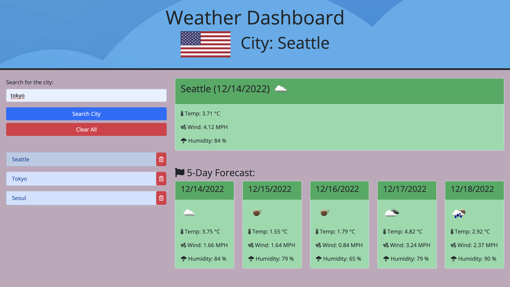
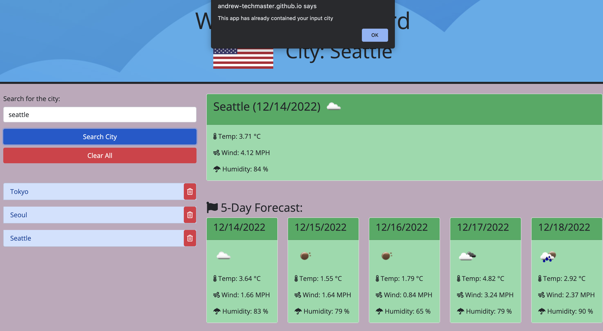
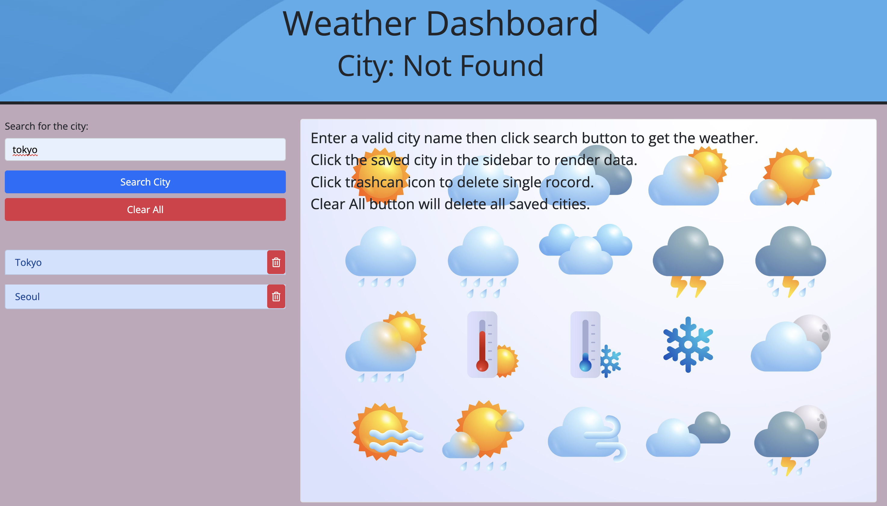

# Andrew's Weather Dashboard

## 🐳 Overview:
> * HTML, CSS(BootStrap), JavaScript(JQuery), Server-Side API(OpenWeather)
>
> * Using OpenWeather API's country property then passing to the flag API. 
>
> * Clear All to delete all data, trash can icon to delete single record.

> **Note**: I use free plan in OpenWeather, so in fact the data in the future is every morning weather. 
>


## 🐯 Website URL:
❗❗❗ ☛ [Clik Me To The Page!](https://andrew-techmaster.github.io/Andrew-UWBootcampChallenge-06-Weather-Dashboard/) ☚ ❗❗❗
```
https://andrew-techmaster.github.io/Andrew-UWBootcampChallenge-06-Weather-Dashboard/
```

## 🦊 Screenshots Of The Applications:

||
|:--:| 
| *Overview of the application* |

||
|:--:| 
| *Prevent from same input already saved in the loacl storage* |

||
|:--:| 
| *If user delete the record, defalut page will show up & the header will be not found* |
- - -
© 2022 edX Boot Camps LLC. Confidential and Proprietary. All Rights Reserved.
